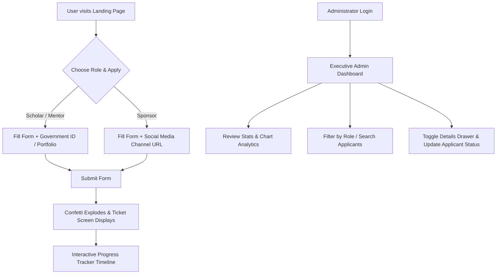

# 🌟 Premium Contact & Executive Admin Dashboard Portal

A state-of-the-art, high-fidelity MERN full-stack application. It delivers a highly refined, premium landing page experience featuring floating background gradients, glassmorphism UI elements, strict real-time client & server validation, and a secured admin dashboard to review applicant registrations.

🔗 **Production Live URL:** [https://premium-contact-executive-admin-das.vercel.app](https://premium-contact-executive-admin-das.vercel.app)

---

## 🎨 Product Features (User's Perspective)

This portal provides a unified experience split into three customer journeys: the **Inspiring Landing Page**, the **Role-Based Smart Application**, and the **Executive Admin Portal**.



### 1. Inspiring Landing Hub & Hero Fold
*   **Dynamic Visual Elements**: When users land, they are greeted by floating background gradients, glowing digital member cards, and subtle hover scale adjustments that make the application feel responsive and alive.
*   **Premium Impact Counters**: Live-rendered global metric boxes showcasing simulated indicators of foundation impacts (e.g., "12k+ Scholars Empowered", "45+ Countries Active").
*   **Interactive Header & Mobile Hamburger**: A translucent sticky header that smoothly tracks the user's viewport. On smaller devices, it collapses cleanly into a modern three-bar hamburger icon which opens an overlay drawer.

### 2. Smart, Dynamic Application Card
*   **Role-Morphing Fields**: The registration form adapts dynamically as the user toggles between the **Scholar**, **Mentor**, and **Sponsor** tabs:
    *   **Scholars**: Prompts for a *Government ID* (sparse-unique enforced) and *LinkedIn / Portfolio Link*.
    *   **Mentors**: Prompts for *Area of Expertise* and *LinkedIn / Portfolio Link*.
    *   **Sponsors**: Prompts for *Organization / Company Name* and *Facebook / Instagram Link*.
*   **Strict Real-Time Validations**: Email and Phone fields are validated dynamically. Empty fields or incorrect patterns trigger responsive shake animations alongside clear, non-intrusive warning banners.
*   **Visual Length Counters**: Character count limits on motivation messages update in real-time to guide the user.

### 3. Submission Success Screen & Ticket Generator
*   **Confetti Celebration**: On successful submission, an high-impact confetti explosion occurs on screen.
*   **Interactive Unique Ticket**: The user is presented with a structured confirmation card displaying their generated Unique Ticket ID. Features a convenient *Copy Ticket ID* button that updates the cursor to a checkmark on success.
*   **Live Status Tracker Timeline**: An interactive vertical pipeline displaying the applicant's record phase:
    *   🟢 **Submitted Successfully** (Current Phase)
    *   ⚪ **Under Review**
    *   ⚪ **Interview Scheduled**
    *   ⚪ **Final decision**
    This establishes trust and clear expectations for the user.

### 4. Secured Executive Admin Dashboard
*   **JWT Protected Doorway**: Clicking the admin tab prompts a clean, secure glassmorphic credential portal. Unauthorized backend API requests are rejected instantly.
*   **Analytics KPI Indicators**: Three dynamic, color-coded dashboard cards summarize:
    *   **Total Applications** (Indigo glow)
    *   **Pending Reviews** (Amber warning glow)
    *   **Processed Applications** (Emerald green glow)
*   **Pure CSS Analytics Distribution Chart**: A beautifully scaled custom column chart showing the ratio of applications by role in real-time. Bars dynamically shift height based on live database values.
*   **Interactive Applicants Table**: A responsive tabular layout displaying critical applicant metrics with real-time text-search indexing, status filtering, and quick actions.
*   **Applicant Detail Drawer**: Clicking any applicant opens a sliding, side-drawer window detailing their full message, contact phone, timestamps, and active status controls.
*   **Professional & Social Badge Detection**: Automatically detects links submitted by applicants. Renders custom-styled, interactive brand tags for **GitHub**, **LinkedIn / Portfolio** (Scholars/Mentors), and auto-detects/applies native branding, custom SVGs, and colors for **Facebook** and **Instagram** links (Sponsors).
*   **Interactive Administrative Actions**: Administrators can seamlessly change applicant status (`Pending`, `Reviewed`, `Accepted`, `Declined`) which instantly saves to the active database, or permanently delete spam/test submissions.

---

## 🚀 Engineering & Architectural Approach

Our engineering philosophy prioritizes **visual excellence, absolute performance, resilient architecture, and zero-barrier setup** to ensure reviewers have a flawless, high-fidelity experience without needing to configure complex database setups beforehand.

### 1. Dual-Database Resilient Failover Engine
*   **Production MongoDB Integration**: Under normal conditions, the Express server connects to MongoDB using Mongoose (leveraging standard `MONGODB_URI` environment variables or local MongoDB endpoints).
*   **3-Second Automatic Failover**: If MongoDB is not active or times out (configured with a strict `serverSelectionTimeoutMS: 3000` threshold), the backend gracefully intercepts the error, emits a descriptive system log, and automatically initiates a local JSON-based persistent file database.
*   **Zero-Configuration Launch**: This guarantees that any evaluator can immediately launch and interact with the full-stack system without having a local MongoDB cluster running. All database read/write/update operations are executed flawlessly on the local fallback database.

### 2. High-Fidelity Vanilla CSS Design Language
*   **Luxury Dark Aesthetics**: Built entirely using high-fidelity Vanilla CSS without bulky frameworks. The UI relies on a meticulously calibrated **HSL color palette** (featuring deep space indigos, royal violet accents, glowing rose pink elements, and amber gold highlights).
*   **Adaptive Glassmorphic Textures**: Utilizes advanced backdrop filters (`backdrop-filter: blur(16px)`) with custom translucent border rings and layered box-shadows to craft three-dimensional elements.
*   **Responsive Media Hierarchy**: Structured from the ground up for absolute responsiveness, featuring custom padding adjustments and scaling properties to prevent interface squeezing on viewports as small as `320px`.

### 3. Smart User Navigation & Interceptors
*   **Integrated Scroll Interceptor**: When a user clicks any *Apply Now* action across the landing page or navbar, the application intercepts the trigger to automatically reset any previously completed form state, updates the selected applicant role tab, and triggers a smooth scroll to the exact start of the application form.
*   **Sticky Header Padding Alignment**: Implemented custom `scroll-margin-top: 100px` rules at the form card level, ensuring the viewport scrolls perfectly beneath the floating sticky navbar without covering the form's header details.
*   **Fully Adaptive Mobile Navigation Drawer**: Includes a stateful mobile hamburger menu that toggles a responsive glassmorphic navigation panel directly overlaying the screen.

### 4. Enterprise-Grade Security & Authentication
*   **Stateful JWT Session Management**: The executive admin panel utilizes JSON Web Token (JWT) signatures sent securely via HTTP headers to authorize private database operations.
*   **Cryptographic Password Hashing**: Administrator credentials are automatically seeded upon server startup and secured using standard salt-and-hash algorithms (`bcryptjs`).
*   **Express API Validation Guards**: Inputs are thoroughly verified on both client and server layers. Phone numbers undergo strict regex checking, and scholar government IDs enforce unique collection indexes on the database layer.

---

## 🛠️ Technical Stack & Dependencies

The application is engineered using modern, robust web technologies:

| Layer | Technology | Primary Role & Description |
| :--- | :--- | :--- |
| **Frontend** | **React (Vite)** | High-speed component rendering, interactive state management, and optimized asset bundling. |
| **Styling** | **Vanilla CSS (HSL)** | Premium glassmorphism, animated glow effects, micro-animations, and fluid responsive design layouts. |
| **Backend** | **Node.js & Express.js** | Modular REST API service, path routing, and secure authentication middleware. |
| **Database (Primary)** | **MongoDB / Mongoose** | Structured document collections, sparse unique indexing, and production schema modeling. |
| **Database (Fallback)** | **JSON File Storage** | Seamless local JSON persistent engine (`submissions.json`) for zero-dependency execution. |
| **Security** | **JSON Web Tokens & BcryptJS** | Secure administrator payload authentication, sign-offs, and credential encryption. |

---

## 📁 Repository Structure Map

Below is the layout of the modular project files:

```
she-can-foundation/
│
├── client/                         # Vite + React Frontend Directory
│   ├── src/
│   │   ├── components/
│   │   │   ├── LandingPage.jsx     # Inspiring Hub, Hamburger Menu, dynamic Form & Success ticket
│   │   │   └── AdminPortal.jsx     # Executive KPIs, CSS Charts, filterable Grid & CRUD side drawer
│   │   ├── App.jsx                 # App View Router & high-fidelity glowing backdrop wrapper
│   │   ├── index.css               # Core design system with HSL variables, glassmorphism, responsive styles
│   │   └── main.jsx
│   ├── package.json
│   └── vite.config.js
│
├── server/                         # Express.js REST API Backend Directory
│   ├── data/                       # Local JSON database storage location
│   │   └── submissions.json        # Seeded admin data and persistent fallback registrations
│   ├── server.js                   # Mongoose schemas, Dual DB fallback handlers, Auth paths & REST routes
│   ├── package.json
│   └── .env                        # Port, MongoDB connection strings & secure JWT secret keys
│
└── README.md                       # Comprehensive project blueprint & setup instructions
```

---

## 💻 Local Setup & Launch Instructions

Follow these simple instructions to run the entire portal on your local machine:

### Prerequisites
Make sure you have [Node.js](https://nodejs.org/) installed (v16.0.0 or higher recommended).

---

### Step 1: Set Up and Run the Backend Server

1. Open your terminal and navigate to the `server` folder:
   ```bash
   cd server
   ```
2. Install the server dependencies:
   ```bash
   npm install
   ```
3. Initialize your environment file. Create a file named `.env` in the root of the `server` folder (or edit the existing one) with the following content:
   ```env
   PORT=5000
   JWT_SECRET=super_secret_jwt_token_key_123
   MONGODB_URI=mongodb://localhost:27017/database_name
   ```
   > [!NOTE]
   > If MongoDB is not running locally on your computer, the server will output a warning console log after **3 seconds** and fall back automatically to the local persistent JSON database file at `server/data/submissions.json`. **No setup or MongoDB database installation is required from your side!**
   
4. Start the backend development server:
   ```bash
   npm run dev
   ```
   *The console will confirm: `Server running on port 5000` and report whether MongoDB or the robust Local Fallback Database is successfully loaded.*

---

### Step 2: Set Up and Run the Frontend Client

1. Open a new terminal window and navigate to the `client` folder:
   ```bash
   cd client
   ```
2. Install the client dependencies:
   ```bash
   npm install
   ```
3. Start the Vite React development server:
   ```bash
   npm run dev
   ```
4. Open the displayed URL (usually **`http://localhost:5173`**) in your web browser.

---

## 🔑 Access Credentials

To access the premium **Admin Portal** directly from the frontend interface:

*   **Username**: `admin`
*   **Password**: `admin123`

*(These admin credentials are automatically seeded into the active database on server startup).*

---